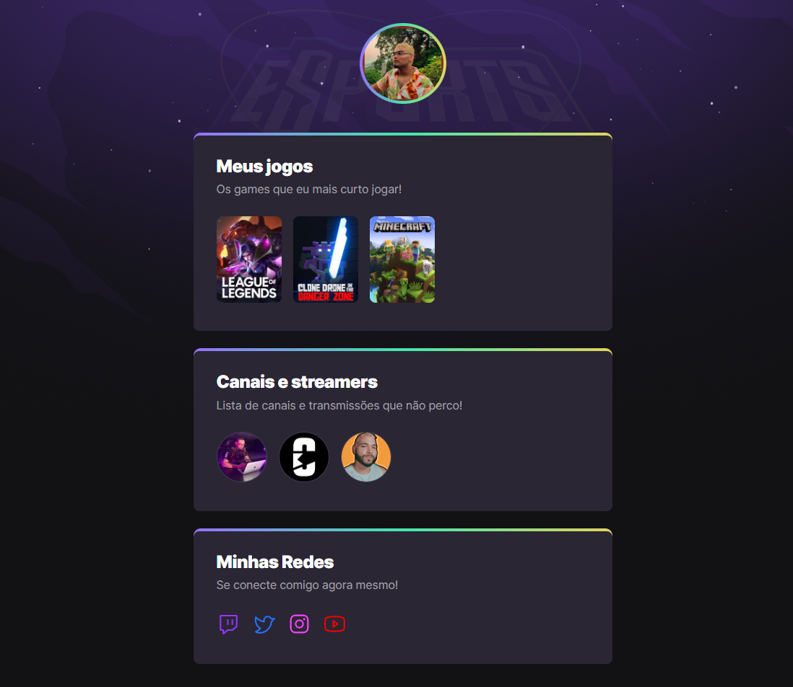

## :grinning: hi

# NLW eSports - Trilha Explorer

> Trilha Explorer

Projeto construído do evento Next Level Week da Rocketseat

## :hammer_and_wrench: Tecnologias

- HTML
- CSS
- GIT E Github
- Figma

## :calling: Contato

vitorsmfff@yahoo.com

# Sobre
---
desenvolvi este projeto com muito esforço no qual fui tutorado pelo professor [**Mayk Brito**](https://github.com/maykbrito)
no qual exercitei CSS, HTML, FIGMA, VSCODE bem como suas integrações ao GIT e Github, meu projeto está hospedado aqui neste link: :link:[**Clique aqui se tiver coragem**](https://vitorsmx.github.io/VSM-NLW-eSports-Explorer/)

### Fiquem à vontade para usar como base para seus projetos, eu mesmo pretendo usar para futuros Free-lancers :smile_cat:
